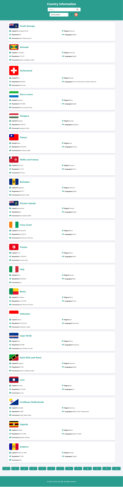
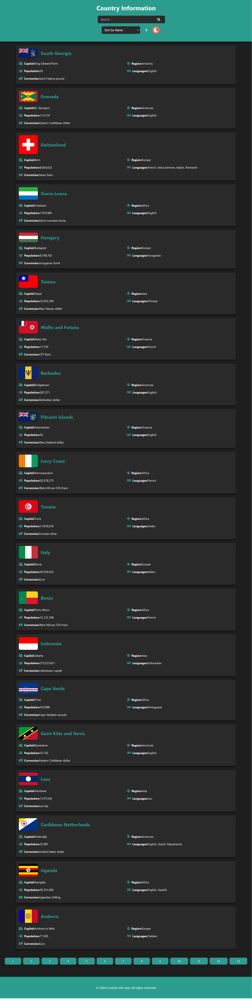
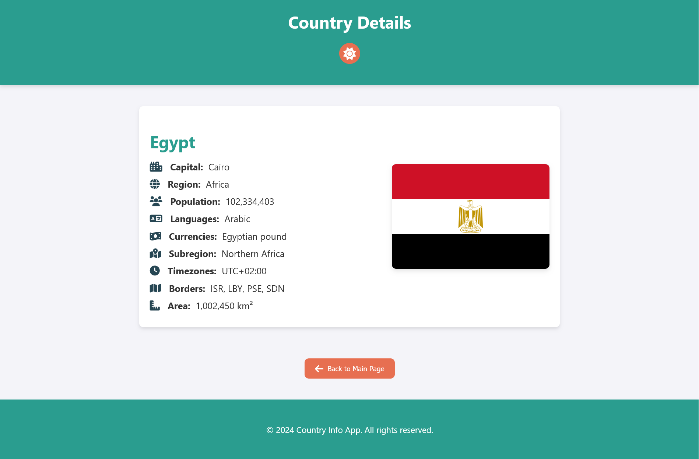
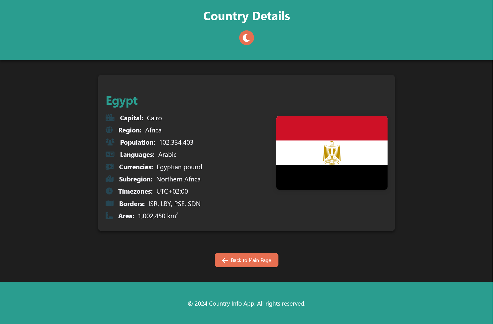
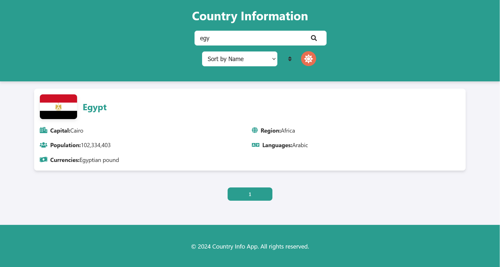
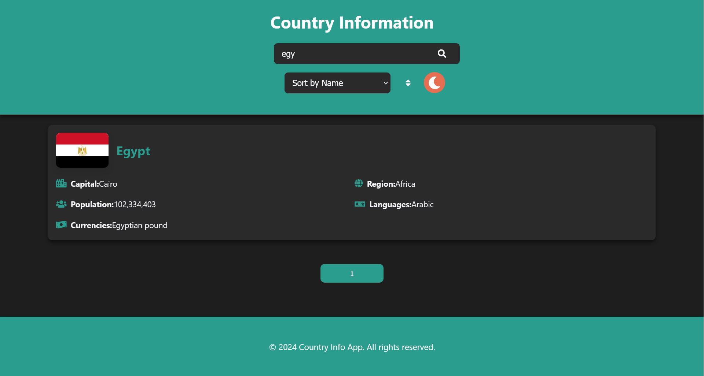

# Country Info Explorer

Country Info Explorer is a web application that allows users to explore detailed information about countries worldwide. The app fetches data from the RestCountries API and displays it in a user-friendly interface. Users can search for countries, sort them by various criteria, and switch between light and dark themes.

## Features

- **Fetch and display country data:** Includes details like the capital, population, region, languages, and currencies.
- **Search and filter:** Search for countries by name and filter results easily.
- **Sort options:** Sort countries by name, population, or region.
- **Dark mode toggle:** Switch between light and dark themes.
- **Country details page:** Click on any country to view detailed information on a separate page.

## Project Structure

- **index.html:** The main page of the application where countries are listed.
- **details.html:** The page where detailed information about a selected country is displayed.
- **style.css:** Contains the styling for the application, including support for light and dark themes.
- **app.js:** Handles the fetching of country data and the main functionality like searching, sorting, and pagination.
- **details.js:** Manages the display of detailed country information on the `details.html` page.
- **api.js:** Contains the function to fetch country data from the API.
- **ui.js:** Handles the user interface updates, including displaying countries and pagination.

## Project Structure

- JavaScript
- RESTful API
- Web Development
- Front-end Development
- CSS Grid
- Responsive Design
- Dark Mode

## Screens

The app consists of the following screens:

1. **Home Screen Light Theme**: 
   

2. **Home Screen Dark Theme**: 
    

3. **Details Screen Light Theme**: 
   

4. **Details Screen Dark Theme**: 
    

5. **Search Input Screen Light Theme**: 
   

5. **Search Input Screen Dark Theme**: 
    

## Getting Started

### Prerequisites

- A modern web browser
- Internet connection to fetch data from the RestCountries API

### How to Use

1. Clone the repository:
   ```bash
   git clone https://github.com/MoSalem149/Country-Info-Explorer.git
